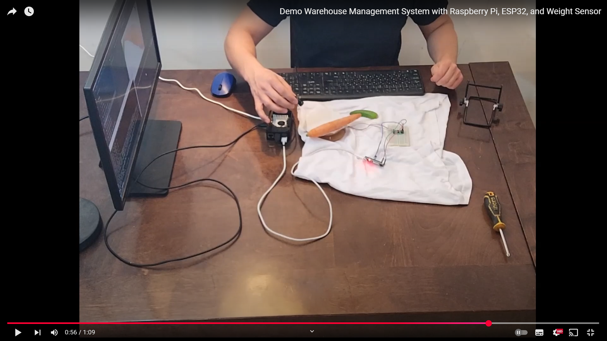
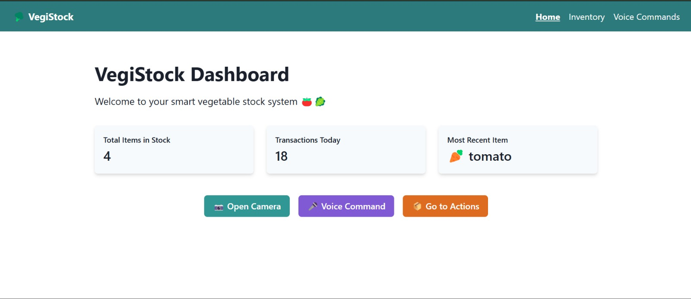
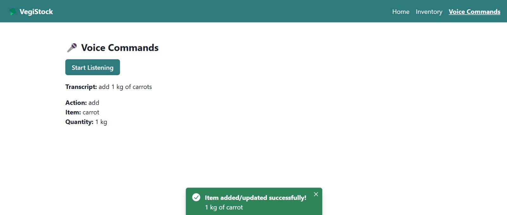
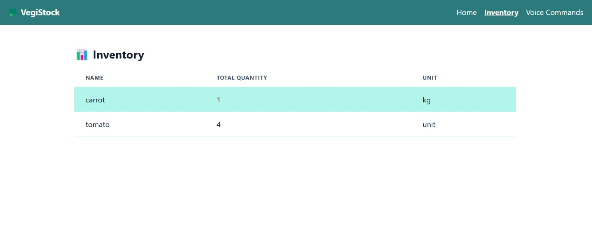
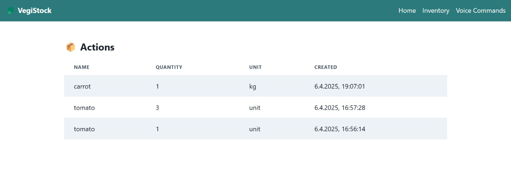

# Smart Agricultural Warehouse System 🌱

This is a full-stack system for managing an agricultural warehouse using AI and embedded systems.

---

## 🎬 Demo Video

[Automated Inventory Management System Demo video](https://www.youtube.com/watch?v=yazTxDFBqBg)

---

## 🖼️ System in Action

---

## 📦 Components

1. 📡 [Embedded System - Raspberry Pi + ESP32](https://github.com/Oleg-lafer/Automated-Inventory-Management-System-RaspberryPi-ESP32)  
   Integrates weight (HX711), temperature (DHT), and ultrasonic (HC-SR04) sensors with camera control and real-time image prediction.

2. 🧠 [Vegetable Classifier - CNN + TensorFlow](https://github.com/Oleg-lafer/Vegetable-Classifier-CNN-TensorFlow)  
   A deep learning model for classifying vegetables in images, using TensorFlow (InceptionV3) and OpenCV for preprocessing.

3. 🌐 [Warehouse Management Web App](https://github.com/Oleg-lafer/Warehouse-Manegenent-App)  
   A full-stack web interface for tracking vegetable inventory, visualizing sensor data, and managing warehouse operations.

---

## 🧩 System Architecture

_(Here you can add an image or diagram showing how the Raspberry Pi, ESP32, ML model, and web app communicate)_

---

Feel free to explore each repository to understand its role in the full system.
